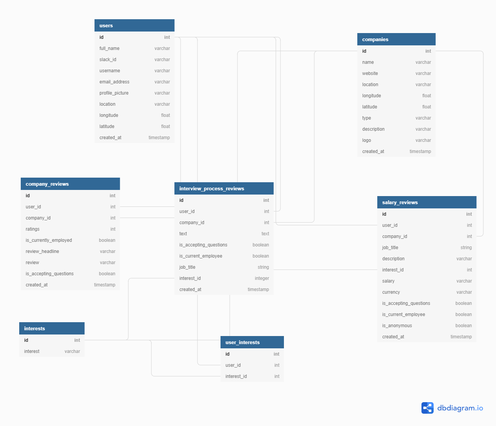

# LambdaDoor API

[](https://travis-ci.com/LABS-EU3/lambdaDoor_backend)
[](https://coveralls.io/github/LABS-EU3/lambdaDoor_backend?branch=develop)

### About

The one-stop portal for Lambda graduates looking for company information in the quest for a job.

### Features

- View and post interview reviews
- View and post salary reviews
- View and post work culture reviews

### Application Links

### [Product Vision Document](https://www.notion.so/EU3-Lambda-Door-e78fd9396061487b8b458a28912d66c4)

### [API Link](https://lambdadoor.herokuapp.com/)

### [Trello board](https://trello.com/b/YdfO1w9X/lambda-door)

### NPM Scripts

To get the server running locally:

- Clone this repo
- **npm install** to install all required dependencies
- **npm run server** to start the local server
- **npm test** to start server using testing environment
- **npm run migrate** to migrate the tables
- **npm run seed** to seed the tables
- **npm run rollback** to rollback all tables

## Technologies

[NodeJS](https://nodejs.org/en/) - is a JavaScript runtime built on Chrome's V8 JavaScript engine.

The [**Express.js**](https://expressjs.com/) backend framework was used to build the server. Fast, unopinionated, minimalist web framework for Node.js

#### Why Express.js

- Express is fast.
- Express is efficient.
- Express is scalable.
- Express is a lightweight framework.

## Supporting Packages

Linter

- [ESLint](https://eslint.org/) - The pluggable linting utility for JavaScript and JSX

Test Tools

- [Jest](https://jestjs.io/) - Jest is a delightful JavaScript Testing Framework with a focus on simplicity.
- [Supertest](https://github.com/visionmedia/supertest)

## API Documentation

The API endpoints for the server is on Heroku and can be found [here.](https://lambdadoor.herokuapp.com/)

#### User Routes

| Method | Endpoint            | Access Control | Description                            |
| ------ | ------------------- | -------------- | -------------------------------------- |
| POST   | `/users/`           | all users      | Adds a new user if user doesn't exist. |
| GET    | `/users/:id`        | all users      | Returns info for a user.               |
| PATCH  | `/users/:id`        | all users      | Edits information for a user.          |
| GET    | `/users/:id/logout` | all users      | Logs out a user by deleting cookies.   |

#### Data Model



#### USERS

---

```javascript
{
  id int [pk, increment]
  full_name varchar
  username varchar
  email_address varchar
  password varchar
  is_employed varchar
  is_email_verified boolean
  is_admin boolean [default: false]
  profile_picture varchar
  created_at timestamp
}
```

## Actions

### Add a new user [POST]

**URL**: _https://lambdadoor.herokuapp.com/users_

**Returns**: An object containing the user credentials.

Input

```javascript
{
 "slack_id": "slack_id",
 "name": "name",
 "email_address": "email_address",
 "img_72": "image_url"
}
```

```javascript
{
    "id": 16,
    "full_name": "name",
    "slack_id": "slack_id",
    "username": "name",
    "email_address": "email_address",
    "profile_picture": "image_url",
    "location": null,
    "longitude": null,
    "latitude": null,
    "created_at": null,
    "updated_at": null
}
```

### Edit User[PATCH]

**URL**: _https://lambdadoor.herokuapp.com/users/16_

**Returns**: An array containing an object which holds the users credentials.

Input

```javascript
{
 "location": "earth"
}
```

Returns

```javascript
[
  {
    id: 16,
    full_name: 'name',
    slack_id: 'slack_id',
    username: 'name',
    email_address: 'email_address',
    profile_picture: 'image_url',
    location: 'earth',
    longitude: null,
    latitude: null,
    created_at: null,
    updated_at: null,
  },
];
```

### Get a user [GET]

**URL**: _https://lambdadoor.herokuapp.com/users/16_

**Returns**: An object with the user details

Returns

```javascript
{
    "id": 16,
    "full_name": "name",
    "slack_id": "slack_id",
    "username": "name",
    "email_address": "email_address",
    "profile_picture": "image_url",
    "location": "earth",
    "longitude": null,
    "latitude": null,
    "created_at": null,
    "updated_at": null
}
```

#### Company Routes

| Method | Endpoint                 | Access Control | Description                                           |
| ------ | ------------------------ | -------------- | ----------------------------------------------------- |
| GET    | `/companies/`            | all users      | Returns all companies in the db.                      |
| GET    | `/companies/top`         | all users      | Returns 5 top rated companies.                        |
| GET    | `/companies/:id/closest` | all users      | Returns the closest companies to the user's location. |

#### COMPANIES

---

```javascript
{
  id int [pk, increment]
  name varchar
  website varchar
  location varchar
  latitude numeric
  longitude numeric
  type varchar
  description varchar
  logo varchar
  created_at timestamp
}
```

## Actions

### Get all companies [GET]

**URL**: \_https://lambdadoor-staging.herokuapp.com/companies

**Returns**: An array of companies in the db

Returns

```javascript
[
    {
        "id": 1,
        "name": "Accenture",
        "website": "www.accenture.com.",
        "location": "Atlanta, GA",
        "type": "Business",
        "logo": "",
        "description": "",
        "created_at": null,
        "updated_at": null,
        "latitude": 33.7537,
        "longitude": -85
    },

   ...
]
```

### Get top-rated companies [GET]

**URL**: \_https://lambdadoor-staging.herokuapp.com/companies/top

**Returns**: An array of the five top-rated companies in the db and their average rating

Returns

```javascript
[
    {
        "id": 5,
        "name": "DoNotPay Inc",
        "description": "",
        "average_rating": "5.0000000000000000"
    },

  ...
]
```

### Get closest companies to the user's location [GET]

**URL**: \_https://lambdadoor-staging.herokuapp.com/companies/:id/closest

**Returns**: An array of the closest companies to the user's location

Returns

```javascript
[
    {
        "id": 2,
        "name": "Anthem, Inc.",
        "website": "https://www.antheminc.com",
        "description": "",
        "latitude": 33.8,
        "longitude": -84.5
    },

    ...
]
```

## Environment Variables

In order for the app to function correctly, the user must set up their own environment variables.

Create a .env file that includes the following:

- PORT - The port the server will start on.
- DATABASE_URL - The PostgreSQL database url.
- ACCESS_TOKEN_SECRET - The test url.

## Contributing

When contributing to this repository, please first discuss the change you wish to make via issue, email, or any other method with the owners of this repository before making a change.

Please note we have a [code of conduct](./code_of_conduct.md). Please follow it in all your interactions with the project.

### Issue/Bug Request

**If you are having an issue with the existing project code, please submit a bug report under the following guidelines:**

- Check first to see if your issue has already been reported.
- Check to see if the issue has recently been fixed by attempting to reproduce the issue using the latest master branch in the repository.
- Create a live example of the problem.
- Submit a detailed bug report including your environment & browser, steps to reproduce the issue, actual and expected outcomes, where you believe the issue is originating from, and any potential solutions you have considered.

### Feature Requests

We would love to hear from you about new features which would improve this app and further the aims of our project. Please provide as much detail and information as possible to show us why you think your new feature should be implemented.

### Pull Requests

If you have developed a patch, bug fix, or new feature that would improve this app, please submit a pull request. It is best to communicate your ideas with the developers first before investing a great deal of time into a pull request to ensure that it will mesh smoothly with the project.

Remember that this project is licensed under the MIT license, and by submitting a pull request, you agree that your work will be, too.

#### Pull Request Guidelines

- Ensure any install or build dependencies are removed before the end of the layer when doing a build.
- Update the README.md with details of changes to the interface, including new plist variables, exposed ports, useful file locations and container parameters.
- Ensure that your code conforms to our existing code conventions and test coverage.
- Include the relevant issue number, if applicable.
- You may merge the Pull Request in once you have the sign-off of two other developers, or if you do not have permission to do that, you may request the second reviewer to merge it for you.

### Attribution

These contribution guidelines have been adapted from [this good-Contributing.md-template](https://gist.github.com/PurpleBooth/b24679402957c63ec426).

## Documentation

See [Frontend Documentation](https://github.com/LABS-EU3/lambdaDoor_frontend) for details on the frontend of our project.
